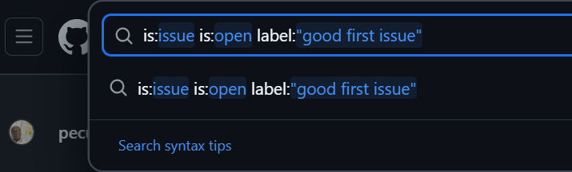

# How to search for Good First Issues on GitHub

### Direct Search on Github: 
On the GitHub HOME, search for these keywords
   
```
is:issue is:open label:"good first issue"
```


### Filter by language

### Check for unassigned issues etc.

# List of good First Issus

[Open good first issues](https://forgoodfirstissue.github.com/)
[Good First Issues](https://github.com/topics/good-first-issue)


